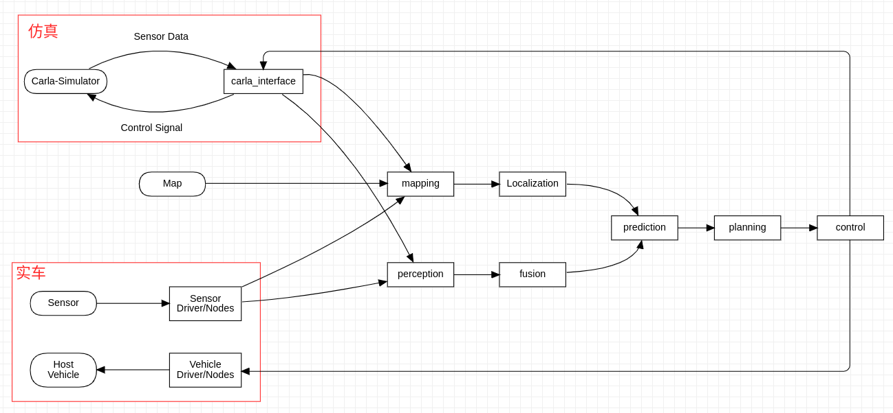

# 系统架构设计（System Architecture Design）

> Author: Andy 
>
> Email: yjd2008@hotmail.com

JoyPilot主要从Autoware.Auto中的AVP这个OOD场景衍生出来，因此系统架构设计也主要是基于AVP这个OOD。

系统架构按照传统的4+1视图描述。

## 一、场景图

> The AVP demonstration uses Autoware.Auto to provide the following functions:
>
> 1. Automatically drive a car from a pre-defined drop-off zone (e.g. the entrance to a car park) to a parking spot indicated by an external system.
> 2. Park a car in a parking spot, starting in a lane near that parking spot.
> 3. Drive out of a parking spot.
> 4. Drive to a pre-defined pick-up zone (e.g. the exit from a car park).
> 5. Automatically stop for obstacles while achieving the above.

以上内容引用自Autoware.Auto官方文档对AVP场景的描述[1]，同样适用于JoyPilot，区别在于仿真器从LgSVL迁移到Carla。

图1-1：Autonomous Valet Parking[1].

## 二、物理视角

图2-1：物理视角

如图(2-1)所示，一台PC用于仿真器和可视化显示，另外一台用于开发和部署，不使用异构架构的板子测试。

## 三、逻辑视角

图3-1：逻辑视角（模块包）

## 四、开发视角

TODO

## 五、处理视角

图5-1：处理视角（流程图）

## 附录A-引用

1. https://autowarefoundation.gitlab.io/autoware.auto/AutowareAuto/avpdemo.html

